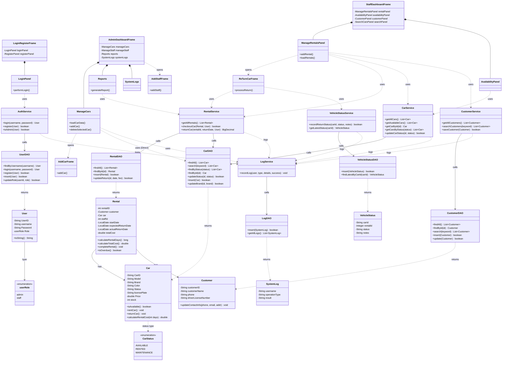
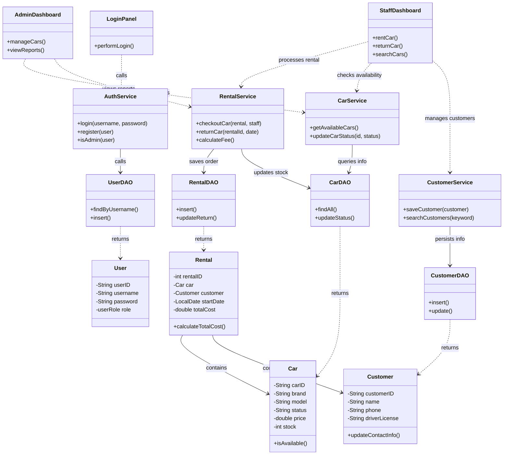
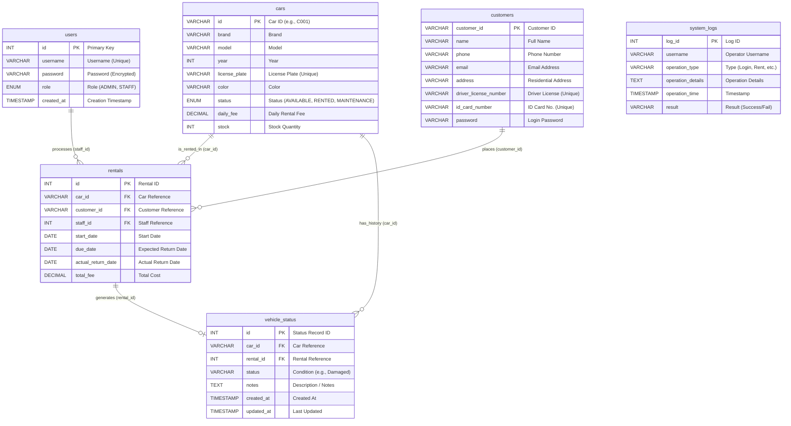

# 🚗 Car Rental Management System

A desktop rental management application built with Java Swing + MySQL
 PRG2201 Object-Oriented Programming · Group Project
 INTI International University · August 2025 Semester

 [](https://github.com/LengxiQwQ/Car-Rental-Management-System)
[](https://maven.apache.org/)
[](https://www.mysql.com/)
[](https://www.java.com/)
[](https://www.formdev.com/flatlaf/)

[](https://github.com/LengxiQwQ/Car-Rental-Management-System)
[](https://github.com/LengxiQwQ/Car-Rental-Management-System#%E5%B7%A8%E5%B3%B0%E6%8A%80%E6%9C%AF)

📘 **English | [简体中文](README_CN.md)** 

------

## 📌 1. Project Introduction

The Car Rental Management System is a complete desktop application built using **Java Swing + JDBC + MySQL**, designed to help car rental companies digitize their operations.

The system includes:

- **Admin functionalities**
- **Staff functionalities**
- Full **rental lifecycle management**
- Modern Swing-based GUI
- Complete database support and logging system

Originally created as the final assignment for **PRG2201 — Object-Oriented Programming**, this project is now released as an open-source reference suitable for:

- Java beginners
- Swing GUI development learners
- JDBC + MySQL learning
- Layered architecture demonstration

------

## ✨ 2. Key System Features

### 👑 Admin

- Staff account management (create, update, delete, view)
- Vehicle inventory management (brand/model/plate/rate/status)
- View all rental records
- View reports and statistics (rental count, vehicle availability, revenue)
- View system logs (filter by user or operation type)
- Search vehicles (brand/model/license plate)

### 👨‍💼 Staff

- Handle rental creation (automatic fee calculation)
- Process vehicle returns (including condition reports)
- Update vehicle availability status
- Manage customer information
- View available vehicles in real time
- Quickly search vehicles and customers

------

## 📂 3. Basic Project Structure

```
src/main/java/carrental/
 ├── model/         # Data model classes (Car/User/Rental)
 ├── db/            # Database connection
 ├── dao/           # Database CRUD operations
 ├── service/       # Business logic
 ├── ui/            # Swing GUI & Main entry point
 ├── util/          # Utility classes
database/init.sql   # Database initialization script
```

------

------

## 🏗️ 4. System Architecture (UML Class Diagram)

The following diagram illustrates the interaction between the **Model**, **DAO**, **Service**, and **UI** layers, demonstrating the standard layered architecture pattern used in this project.


### Simplified Core Logic Architecture (UML Class Diagram)




## 🛠️ 5. Tech Stack

- **Java - JDK 21**
- **Swing + FlatLaf UI**
- **MySQL**
- **JDBC**
- **IntelliJ IDEA**
- **Cross-platform support (Windows / macOS / Linux)**

------

## 📸 6. System Screenshots

| Login Page                                                   | Registration Page                                            |
| ------------------------------------------------------------ | ------------------------------------------------------------ |
|  |  |

| Staff Page                                                   | Admin Page                                                   |
| ------------------------------------------------------------ | ------------------------------------------------------------ |
|  |  |

------

## 🗄️ 7. Database Design (MySQL)

Core tables:

| Table Name       | Description                           |
| ---------------- | ------------------------------------- |
| `users`          | Admin and staff accounts              |
| `cars`           | Vehicle information & availability    |
| `customers`      | Customer records                      |
| `rentals`        | Rental transaction records            |
| `vehicle_status` | Vehicle condition details upon return |
| `system_logs`    | System operation logs                 |

### ER Diagram




### Key Design Features

- Foreign key constraints
- State machine (available / unavailable / maintenance)
- Secure SQL using PreparedStatement
- Logging of all critical operations

------

## 🚀 8. Getting Started

### ✔ Step 1 — Clone the repository

```
git clone https://github.com/LengxiQwQ/Car-Rental-Management-System.git
```

------

### ✔ Step 2 — Create the database

```
CREATE DATABASE Car_Rental_Management_System_DB;
```

Import the SQL file afterward.

------

### ✔ Step 3 — Configure database connection

Edit `DBConnection.java`:

```
private static final String URL = "jdbc:mysql://localhost:3306/Car_Rental_Management_System_DB";
private static final String USER = "root";
private static final String PASSWORD = "your_password";
```

------

### ✔ Step 4 — Run the program

Run:

```
src/main/java/carrental/ui/Main.java
```

------

## 📂 9. Full Project Directory Explanation

```
└─src
   └─main
       ├─java
       │  └─carrental
       │      │
       │      ├─dao                     # Data Access Layer — handles database CRUD operations
       │      │      CarDAO.java        # CRUD operations for car data (update stock, change status…)
       │      │      CustomerDAO.java   # Handles customer info (add, update, search)
       │      │      LogDAO.java        # Insert/query system logs
       │      │      RentalDAO.java     # CRUD for rental transactions
       │      │      UserDAO.java       # CRUD for user accounts, login validation
       │      │      VehicleStatusDAO.java # Operations for vehicle condition upon return
       │      │
       │      ├─db                      # Database configuration layer
       │      │      DBConnection.java  # JDBC connection manager (getConnection + close)
       │      │      Information.java   # Stores DB configuration constants (URL, username, password)
       │      │
       │      ├─model                   # Model Layer — Java POJOs mapping database tables
       │      │      Car.java           # Entity for car records (cars table)
       │      │      Customer.java      # Entity for customers (customers table)
       │      │      Rental.java        # Entity for rental transactions (rentals table)
       │      │      SystemLog.java     # Entity for log records (system_logs table)
       │      │      User.java          # Entity for system users (users table)
       │      │      userRole.java      # Enum/constant defining user roles
       │      │      VehicleStatus.java # Entity for vehicle return condition (vehicle_status table)
       │      │
       │      ├─service                 # Business Logic Layer
       │      │      AuthService.java   # Authentication (login validation, registration logic)
       │      │      CarService.java    # Vehicle availability checks, filtering logic
       │      │      CustomerService.java # Validating and maintaining customer data
       │      │      LogService.java    # Centralized log writing logic
       │      │      RentalService.java # Core rental workflow (create order, update stock, etc.)
       │      │      VehicleStatusService.java # Handles vehicle condition during return
       │      │
       │      ├─ui                      # User Interface Layer (Swing)
       │      │  │   Main.java          # Program entry point
       │      │  │
       │      │  ├─Admin                # Admin module components
       │      │  │      AddCarFrame.java
       │      │  │      AddStaffFrame.java
       │      │  │      AdminDashboardFrame.java
       │      │  │      ManageCars.java
       │      │  │      ManageStaff.java
       │      │  │      Reports.java
       │      │  │      SystemLogs.java
       │      │  │
       │      │  ├─LoginRegister        # Login & Registration module
       │      │  │      LoginPanel.java
       │      │  │      LoginRegisterFrame.java
       │      │  │      RegisterPanel.java
       │      │  │
       │      │  └─Staff                # Staff module components
       │      │         AvailabilityPanel.java
       │      │         CustomerPanel.java
       │      │         ManageRentalsPanel.java
       │      │         ReTurnCarFrame.java
       │      │         SearchCarsPanel.java
       │      │         StaffDashboardFrame.java
       │      │
       │      └─util                    # Utility Layer
       │             DateUtil.java
       │             DBUtil.java
       │             TimestampUtil.java
       │             Validator.java
       │
       └─resources
```

------

## 👥 10. Collaborators

| Member         | Responsibilities                                             |
| -------------- | ------------------------------------------------------------ |
| **Qiu Zixun**  | Project initialization, UI design & implementation, admin module logic, GitHub management |
| **Yu Chongqi** | Database design & connection, DAO/Service/Model implementation, staff module logic |
