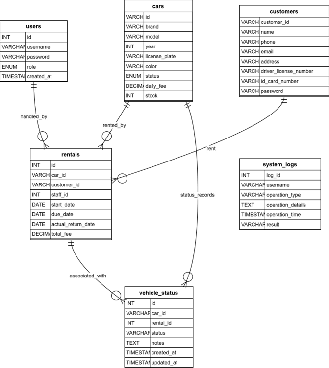

# 🚗 汽车租赁管理系统

基于 Java Swing + MySQL 的桌面级租赁管理应用程序
 PRG2201 面向对象程序设计 · 小组作业
 INTI International University · 2025年8月学期

📘 **[English](README.md) | 简体中文**

------

## 📌 1. 项目简介

汽车租赁管理系统是一款使用 **Java Swing + JDBC + MySQL** 构建的完整桌面应用程序，旨在帮助汽车租赁公司实现业务数字化。

系统包含：

- **管理员 Admin 功能**
- **员工 Staff 功能**
- 完整的 **租赁生命周期管理**
- 美观现代的桌面 GUI
- 完整的数据库支持与日志系统

本项目最初为课程 **PRG2201 — 面向对象程序设计** 的期末作业，目前已以开源形式发布，适合作为：

- Java 初学者练手
- Swing GUI 学习项目
- JDBC + MySQL 教学案例
- 分层架构示例

------

## ✨ 2. 系统功能亮点

### 👑 管理员（Admin）

- 员工账户管理（增删改查）
- 车辆库存管理（品牌/型号/车牌/租金/状态）
- 查看所有租赁记录
- 查看报表与统计（租赁次数、车辆状态、收入）
- 查看系统日志（按用户/操作类型筛选）
- 搜索车辆（品牌/型号/车牌）

### 👨‍💼 员工（Staff）

- 处理租赁创建（自动计算费用）
- 处理还车（含车辆状况记录）
- 修改车辆可用状态
- 管理客户资料
- 实时查看可用车辆
- 快速搜索车辆和客户

------

## 📂 3. 项目基本结构

```
src/main/java/carrental/
 ├── model/         # 数据类（Car/User/Rental）
 ├── db/            # 数据库连接
 ├── dao/           # 数据库 CRUD
 ├── service/       # 业务逻辑
 ├── ui/            # Swing GUI 界面以及 Main 方法
 ├── util/          # 工具类
database/init.sql   # 数据库初始化数据
```

------


## 🛠️ 4. 技术栈

- **Java - JDK 21**
- **Swing + FlatLaf UI**
- **MySQL**
- **JDBC 数据库连接**
- **IntelliJ IDEA**
- **跨平台运行（Win/Mac/Linux）**

------

## 📸 5. 系统截图

|       登录界面                  |注册界面|
| :-----------------------------------: | :-----------------------------------: |
|  | |


| 员工页面                        | 管理员页面                                 |
| ------------------------------- | ---------------------------------------- |
| |  |


------

## 🗄️ 6. 数据库设计（MySQL）

核心数据表：

| 数据表           | 内容               |
| ---------------- | ------------------ |
| `users`          | 管理员与员工账户   |
| `cars`           | 车辆信息与可用状态 |
| `customers`      | 客户资料           |
| `rentals`        | 租赁记录           |
| `vehicle_status` | 车辆还车检查信息   |
| `system_logs`    | 系统操作日志       |

### 实体关系图



### 设计特点

- 外键约束
- 状态机（available/unavailable/maintenance）
- 安全 SQL（PreparedStatement）
- 日志记录所有关键操作

------

## 🚀 7. 快速开始

### ✔ 步骤 1 — 克隆仓库

```
git clone https://github.com/LengxiQwQ/Car-Rental-Management-System.git
```

### ✔ 步骤 2 — 创建数据库

```
CREATE DATABASE Car_Rental_Management_System_DB;
```

导入 SQL 文件。

------

### ✔ 步骤 3 — 修改数据库连接

编辑 `DBConnection.java`：

```
private static final String URL = "jdbc:mysql://localhost:3306/Car_Rental_Management_System_DB";
private static final String USER = "root";
private static final String PASSWORD = "你的密码";
```

------

### ✔ 步骤 4 — 运行程序

运行：

```
src/main/java/carrental/ui/Main.java
```


------

## 📂8. 完整项目目录解析
```
└─src
   └─main
       ├─java
       │  └─carrental
       │      │
       │      ├─dao                     # [数据访问层 Data Access Object] 负责直接与数据库交互
       │      │      CarDAO.java        # 车辆数据的增删改查 (CRUD) 操作，如更新库存、修改状态
       │      │      CustomerDAO.java   # 客户信息的数据库操作，如添加客户、查询客户详情
       │      │      LogDAO.java        # 系统日志的写入与查询操作
       │      │      RentalDAO.java     # 租赁订单的数据库操作，处理租车记录的插入与状态更新
       │      │      UserDAO.java       # 用户（管理员/员工）账户的数据库操作，用于登录验证与管理
       │      │      VehicleStatusDAO.java # 车辆具体状况记录（如划痕、损坏）的数据库操作
       │      │
       │      ├─db                      # [数据库配置层] 处理数据库连接配置
       │      │      DBConnection.java  # JDBC 连接管理类，提供获取连接 (getConnection) 和关闭资源的方法
       │      │      Information.java   # 存储数据库配置常量 (如 URL, Username, Password)
       │      │
       │      ├─model                   # [模型层 Model] 对应数据库表的 Java 实体类 (POJO)
       │      │      Car.java           # 车辆实体类 (对应 cars 表)
       │      │      Customer.java      # 客户实体类 (对应 customers 表)
       │      │      Rental.java        # 租赁订单实体类 (对应 rentals 表)
       │      │      SystemLog.java     # 系统日志实体类 (对应 system_logs 表)
       │      │      User.java          # 用户实体类 (对应 users 表)
       │      │      userRole.java      # 用户角色枚举或常量定义
       │      │      VehicleStatus.java # 车辆状况实体类 (对应 vehicle_status 表)
       │      │
       │      ├─service                 # [业务逻辑层 Service] 处理核心业务规则，桥接 UI 与 DAO
       │      │      AuthService.java   # 认证服务，处理用户登录校验、注册逻辑
       │      │      CarService.java    # 车辆服务，处理车辆筛选、可用性检查逻辑
       │      │      CustomerService.java # 客户服务，处理客户信息的验证与维护
       │      │      LogService.java    # 日志服务，封装日志记录的业务逻辑
       │      │      RentalService.java # 租赁核心服务，处理“创建订单+扣减库存”等事务性逻辑
       │      │      VehicleStatusService.java # 车辆状态服务，处理还车时的车况记录逻辑
       │      │
       │      ├─ui                      # [用户界面层 User Interface] 基于 Swing 的图形界面
       │      │  │   Main.java          # 程序主入口 (Main Class)，负责启动应用程序
       │      │  │
       │      │  ├─Admin                # [管理员模块] 管理员专用的界面组件
       │      │  │      AddCarFrame.java       # “添加车辆”弹窗界面
       │      │  │      AddStaffFrame.java     # “添加员工”弹窗界面
       │      │  │      AdminDashboardFrame.java # 管理员主控台 (Dashboard)
       │      │  │      ManageCars.java        # 车辆管理面板 (列表展示、编辑、删除)
       │      │  │      ManageStaff.java       # 员工管理面板
       │      │  │      Reports.java           # 统计报表界面 (查看租赁历史、收入统计)
       │      │  │      SystemLogs.java        # 系统日志查看界面
       │      │  │
       │      │  ├─LoginRegister        # [登录注册模块]
       │      │  │      LoginPanel.java        # 登录表单面板
       │      │  │      LoginRegisterFrame.java # 登录/注册的主窗口容器
       │      │  │      RegisterPanel.java     # 注册表单面板
       │      │  │
       │      │  └─Staff                # [员工模块] 员工专用的界面组件
       │      │         AvailabilityPanel.java # 车辆可用性查看面板
       │      │         CustomerPanel.java     # 客户管理面板
       │      │         ManageRentalsPanel.java # 租赁业务办理面板 (核心功能)
       │      │         ReTurnCarFrame.java    # 还车处理弹窗
       │      │         SearchCarsPanel.java   # 车辆搜索面板
       │      │         StaffDashboardFrame.java # 员工主控台 (Dashboard)
       │      │
       │      └─util                    # [工具层 Utils] 通用的静态辅助工具
       │             DateUtil.java      # 日期处理工具 (如 Date 与 String 转换)
       │             DBUtil.java        # 数据库辅助工具
       │             TimestampUtil.java # 时间戳获取工具，用于日志记录
       │             Validator.java     # 输入验证工具 (如检查邮箱格式、非空校验)
       │
       └─resources
```

------

## 👥9. 协作者

| 成员       | 主要职责                                                  |
| :--------- | :-------------------------------------------------|
| **邱子迅** | 项目初始化、UI设计与实现、管理员后台逻辑、GitHub 协作管理 |
| **瑜翀祺** |数据库设计与连接、DAO/Service/Model层封装、员工端逻辑实现 |
