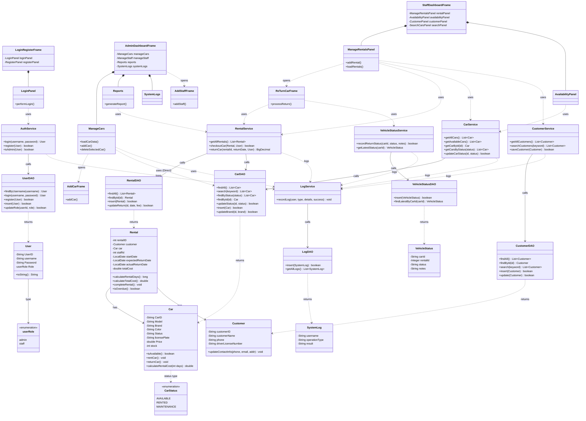
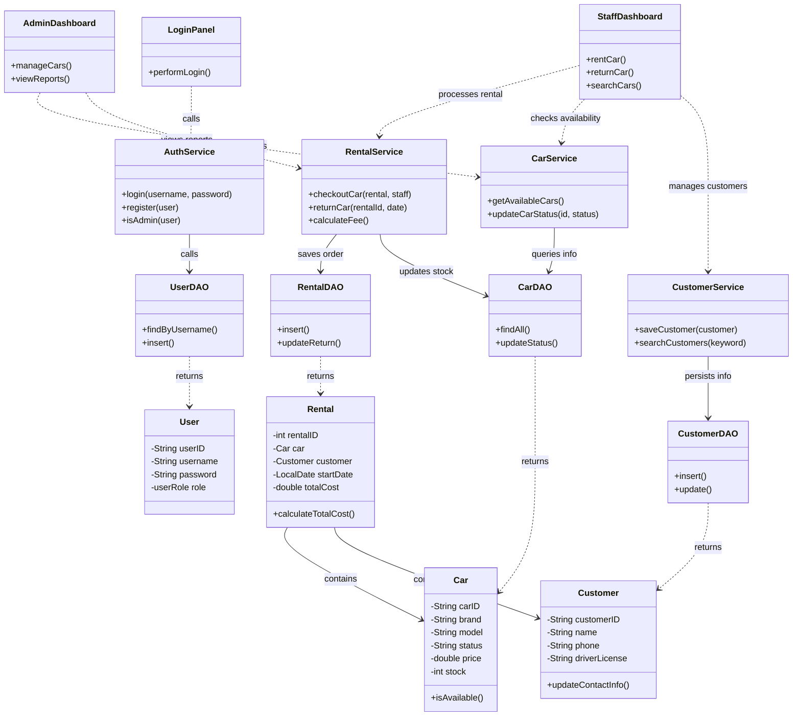
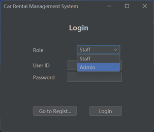
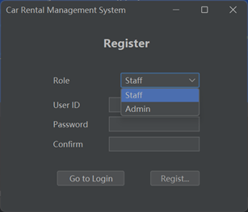
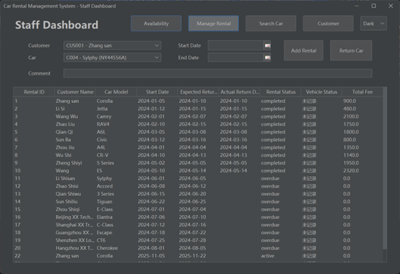
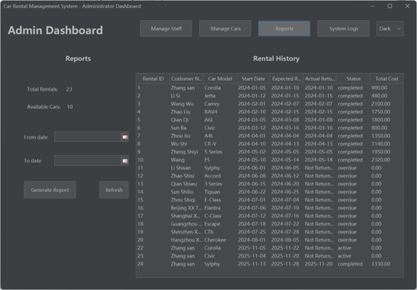
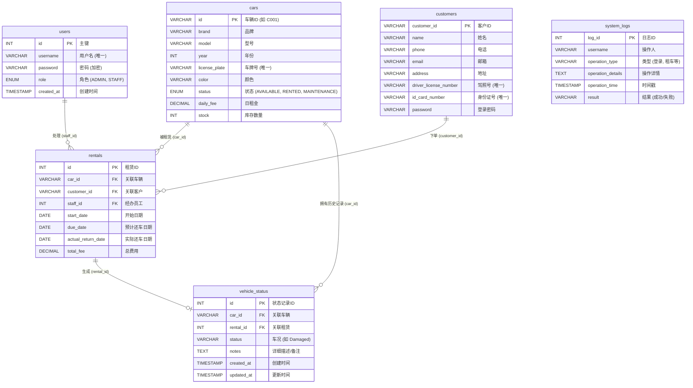

# 🚗 汽车租赁管理系统 (Car Rental Management System)

基于 Java Swing + MySQL 构建的桌面端租赁管理应用
PRG2201 面向对象编程 · 小组作业
英迪国际大学 (INTI International University) · 2025年8月学期

[](https://github.com/LengxiQwQ/Car-Rental-Management-System)
[](https://github.com/LengxiQwQ/Car-Rental-Management-System/actions/workflows/maven.yml)
[](https://www.oracle.com/java/technologies/javase/jdk21-index.html)
[](https://maven.apache.org/)
[](https://www.mysql.com/)
[](https://www.java.com/)
[](https://www.formdev.com/flatlaf/)

📘 **[English](README.md) | 简体中文**

------

## 📌 1. 项目简介

本汽车租赁管理系统是一个基于 **Java Swing + JDBC + MySQL** 开发的完整桌面应用程序，旨在帮助汽车租赁公司实现业务运营的数字化。

系统包含以下核心内容：
- **管理员功能模块**
- **员工功能模块**
- 完整的**租赁生命周期管理**
- 现代化的 Swing 图形用户界面 (GUI)
- 完整的数据库支持与日志记录系统

本项目最初是 **PRG2201 — 面向对象编程** 课程的期末大作业，现在作为开源参考项目发布，特别适合：
- Java 初学者
- Swing GUI 开发的学习者
- JDBC + MySQL 整合的学习者
- 分层架构设计的演示案例

------

## ✨ 2. 系统核心功能

### 👑 管理员 (Admin)

- 员工账号管理（创建、更新、删除、查看）
- 车辆库存管理（品牌/型号/车牌/费率/状态维护）
- 查看所有租赁历史记录
- 查看统计报表（租赁数量、车辆可用率、营收统计）
- 查看系统日志（支持按用户或操作类型筛选）
- 车辆搜索（按品牌/型号/车牌）

### 👨‍💼 员工 (Staff)

- 办理租车业务（自动计算费用）
- 处理还车流程（包含车况检查报告录入）
- 更新车辆可用状态
- 客户信息管理
- 实时查看可用车辆
- 快速搜索车辆与客户

------

## 📂 3. 项目基础结构

```text
src/main/java/carrental/
 ├── model/         # 数据模型类 (Car/User/Rental)
 ├── db/            # 数据库连接配置
 ├── dao/           # 数据库 CRUD 操作 (数据访问层)
 ├── service/       # 业务逻辑层
 ├── ui/            # Swing 图形界面 & 程序入口
 ├── util/          # 通用工具类
database/init.sql   # 数据库初始化脚本
````

-----

## 🏗️ 4. 系统架构 (UML 类图)

下图展示了 **Model (模型层)**、**DAO (数据访问层)**、**Service (业务层)** 和 **UI (界面层)** 之间的交互关系，体现了本项目采用的标准分层架构模式。




### 精简版核心逻辑架构（UML类图）




-----

## 🛠️ 5. 技术栈

  - **Java - JDK 21**
  - **Swing + FlatLaf UI** (现代化主题库)
  - **MySQL**
  - **JDBC**
  - **IntelliJ IDEA**
  - **跨平台支持 (Windows / macOS / Linux)**

-----

## 📸 6. 系统截图

| 登录界面 | 注册界面 |
| :---: | :---: |
|  |  |

| 员工工作台 | 管理员报表 |
| :---: | :---: |
|  |  |

-----

## 🗄️ 7. 数据库设计 (MySQL)

核心数据表说明：

| 表名 | 描述 |
| :--- | :--- |
| `users` | 存储管理员和员工的账户信息 |
| `cars` | 车辆详细信息及库存可用性 |
| `customers` | 客户档案信息 |
| `rentals` | 租赁交易流水记录 |
| `vehicle_status` | 还车时的车况检查详情 |
| `system_logs` | 系统关键操作审计日志 |

### ER 图 (实体关系图)



### 关键设计特性

  - **完整的外键约束**：确保数据一致性。
  - **状态机机制**：管理车辆状态流转 (Available ↔ Rented ↔ Maintenance)。
  - **安全性**：使用 `PreparedStatement` 防止 SQL 注入。
  - **审计追踪**：记录所有关键的增删改查操作。

-----

## 🚀 8. 快速开始 (Getting Started)

### ✔ 第一步 — 克隆仓库

```bash
git clone [https://github.com/LengxiQwQ/Car-Rental-Management-System.git](https://github.com/LengxiQwQ/Car-Rental-Management-System.git)
```

### ✔ 第二步 — 创建数据库

```sql
CREATE DATABASE Car_Rental_Management_System_DB;
```

随后请导入项目提供的 SQL 初始化文件。

### ✔ 第三步 — 配置数据库连接

编辑 `src/main/java/carrental/db/DBConnection.java` (或相应路径)：

```java
private static final String URL = "jdbc:mysql://localhost:3306/Car_Rental_Management_System_DB";
private static final String USER = "root"; // 你的数据库用户名
private static final String PASSWORD = "your_password"; // 你的数据库密码
```

### ✔ 第四步 — 运行程序

运行主程序入口：

```text
src/main/java/carrental/ui/Main.java
```

-----

## 📂 9. 完整项目目录解析

```text
└─src
   └─main
       ├─java
       │  └─carrental
       │      │
       │      ├─dao                     # [数据访问层] 处理所有数据库 CRUD 操作
       │      │      CarDAO.java        # 车辆数据操作 (更新库存、修改状态等)
       │      │      CustomerDAO.java   # 客户信息操作 (添加、更新、搜索)
       │      │      LogDAO.java        # 系统日志写入与查询
       │      │      RentalDAO.java     # 租赁交易处理
       │      │      UserDAO.java       # 用户账户操作、登录验证
       │      │      VehicleStatusDAO.java # 车辆还车状况记录
       │      │
       │      ├─db                      # [数据库配置层]
       │      │      DBConnection.java  # JDBC 连接管理器 (获取连接与释放资源)
       │      │      Information.java   # 存储数据库配置常量 (URL, 账号, 密码)
       │      │
       │      ├─model                   # [模型层] 映射数据库表的 Java 实体类 (POJO)
       │      │      Car.java           # 车辆实体 (对应 cars 表)
       │      │      Customer.java      # 客户实体 (对应 customers 表)
       │      │      Rental.java        # 租赁订单实体 (对应 rentals 表)
       │      │      SystemLog.java     # 日志实体 (对应 system_logs 表)
       │      │      User.java          # 用户实体 (对应 users 表)
       │      │      userRole.java      # 定义用户角色的枚举/常量
       │      │      VehicleStatus.java # 车况实体 (对应 vehicle_status 表)
       │      │
       │      ├─service                 # [业务逻辑层]
       │      │      AuthService.java   # 认证服务 (登录校验、注册逻辑)
       │      │      CarService.java    # 车辆服务 (可用性检查、筛选逻辑)
       │      │      CustomerService.java # 客户数据验证与维护
       │      │      LogService.java    # 集中式日志记录逻辑
       │      │      RentalService.java # 核心租赁流程 (创建订单+扣减库存事务处理)
       │      │      VehicleStatusService.java # 还车时的车况处理
       │      │
       │      ├─ui                      # [用户界面层] Swing 组件
       │      │  │   Main.java          # 程序启动入口
       │      │  │
       │      │  ├─Admin                # 管理员模块组件
       │      │  │      AddCarFrame.java
       │      │  │      AddStaffFrame.java
       │      │  │      AdminDashboardFrame.java
       │      │  │      ManageCars.java
       │      │  │      ManageStaff.java
       │      │  │      Reports.java
       │      │  │      SystemLogs.java
       │      │  │
       │      │  ├─LoginRegister        # 登录注册模块
       │      │  │      LoginPanel.java
       │      │  │      LoginRegisterFrame.java
       │      │  │      RegisterPanel.java
       │      │  │
       │      │  └─Staff                # 员工模块组件
       │      │         AvailabilityPanel.java
       │      │         CustomerPanel.java
       │      │         ManageRentalsPanel.java
       │      │         ReTurnCarFrame.java
       │      │         SearchCarsPanel.java
       │      │         StaffDashboardFrame.java
       │      │
       │      └─util                    # [工具层]
       │             DateUtil.java
       │             DBUtil.java
       │             TimestampUtil.java
       │             Validator.java
       │
       └─resources
```

-----

## 👥 10. 贡献者

| 成员 | 主要职责 |
| :--- | :--- |
| **邱子迅** | 项目初始化、UI 设计与实现、管理员模块逻辑、GitHub 协作管理 |
| **瑜翀祺** | 数据库设计与连接、DAO/Service/Model 层实现、员工模块逻辑 |

```
```